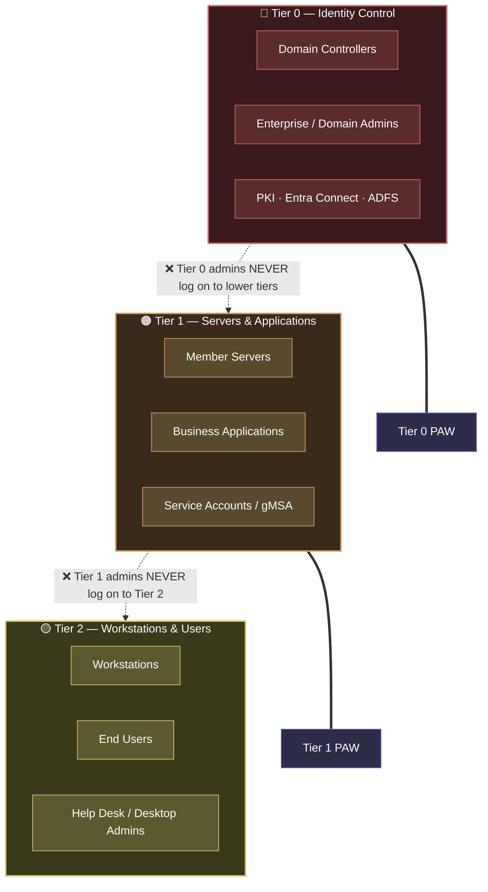

# Active Directory Security Roadmap

A practical, staged roadmap for securing on-premises Active Directory — from zero-budget quick wins to a full administrative tiering model.

Most AD security guidance tells you *what* to configure. This repository focuses on **why** (which attack each control blocks), **how** (exact GPO paths and PowerShell), and **how to verify** that the control actually works — plus the migration path to get there without breaking production.

## Who this is for

Sysadmins and infrastructure engineers running on-prem or hybrid AD who need to raise their security posture incrementally, with limited downtime windows and no dedicated security team.

## The Maturity Roadmap

| Level | Focus | Effort | Blocks | Docs |
|-------|-------|--------|--------|------|
| **0** | [Assessment](docs/00-assessment/) — know where you stand | Hours | Nothing yet — but you can't fix what you can't see | [→](docs/00-assessment/README.md) |
| **1** | [Baseline Hygiene](docs/01-baseline-hygiene/) — patching, backups, legacy protocol cleanup | Days | Wormable exploits, trivial credential theft | [→](docs/01-baseline-hygiene/README.md) |
| **2** | [Quick Wins](docs/02-quick-wins/) — LAPS, Protected Users, LDAP/SMB signing, krbtgt reset | Days | Lateral movement, pass-the-hash, NTLM relay, golden tickets | [→](docs/02-quick-wins/README.md) |
| **3** | [Credential Hardening](docs/03-credential-hardening/) — gMSA, Kerberos hardening, ACL hygiene | Weeks | Kerberoasting, service account abuse, hidden attack paths | [→](docs/03-credential-hardening/README.md) |
| **4** | [Detection](docs/04-detection/) — audit policy, critical Event IDs, honeypots | Weeks | Nothing — but turns a silent breach into an alert | [→](docs/04-detection/README.md) |
| **5** | [Tiering Model](docs/05-tiering-model/) — Tier 0/1/2, PAW, Authentication Silos | Months | Privilege escalation from workstation to domain dominance | [→](docs/05-tiering-model/README.md) |

**The rule of progression:** do not skip levels. Deploying a tiering model on top of a domain full of kerberoastable service accounts and unpatched DCs is security theater. Each level assumes the previous ones are done.

## The destination: the tiering model

Every level in this roadmap builds toward one structural goal — **a credential is only ever exposed on systems at its own trust level or higher, and never touches a lower tier.** Break the path from the most-exposed systems (workstations) to the most-privileged (domain controllers), and a phished laptop no longer leads to domain compromise.



The dashed arrows are the enforced boundaries: higher-tier accounts never authenticate on lower-tier machines, so compromising an exposed tier yields nothing that reaches a privileged one. Administrators work from dedicated **Privileged Access Workstations (PAWs)** per tier. Full detail — and the migration path from a flat domain — is in [Level 5](docs/05-tiering-model/README.md).

## Repository layout

```
docs/            Staged guides (one directory per maturity level)
scripts/         PowerShell — assessment and remediation helpers
lab/             Reproducible Hyper-V lab to test the controls hands-on
gpo-templates/   Reference GPO settings per level
diagrams/        Tiering architecture and attack-path diagrams
```

## Design principles

1. **Every control maps to an attack.** If a recommendation doesn't block or detect a real technique, it's not in here.
2. **Verification included.** Each guide ends with a "verify it worked" section. A GPO that never applied is worse than no GPO — it gives false confidence.
3. **Migration-aware.** The tiering guide (Level 5) is written as a migration path from a flat domain, including what typically breaks and in what order to move.
4. **Current guidance only.** The legacy ESAE / "Red Forest" architecture is retired by Microsoft. This roadmap aligns with the [Enterprise Access Model](https://learn.microsoft.com/en-us/security/privileged-access-workloads/privileged-access-access-model).

## Quick start

1. Run an assessment (Level 0) — [PingCastle](https://www.pingcastle.com/) takes ~15 minutes and gives you a scored report.
2. Fix everything in Level 1. It's boring. It's also where most real-world compromises begin.
3. Work upward. Track your progress per level.

## Contributing

Issues and PRs welcome — especially real-world migration war stories for the tiering guide.

## License

MIT — see [LICENSE](LICENSE).
