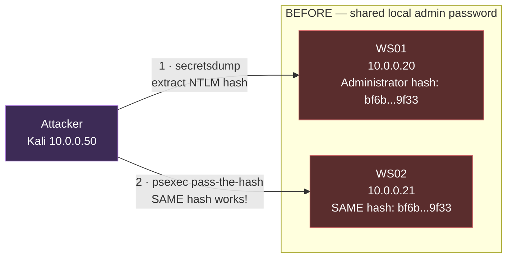
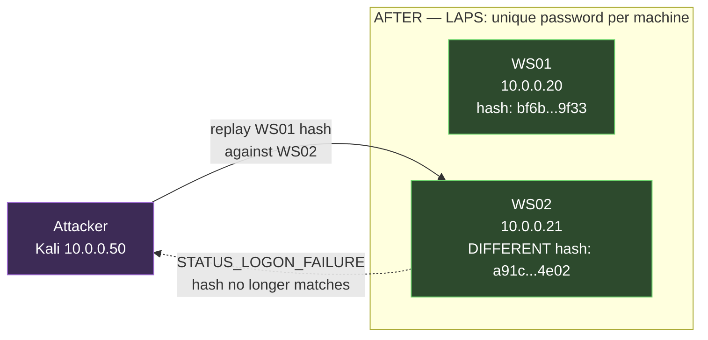
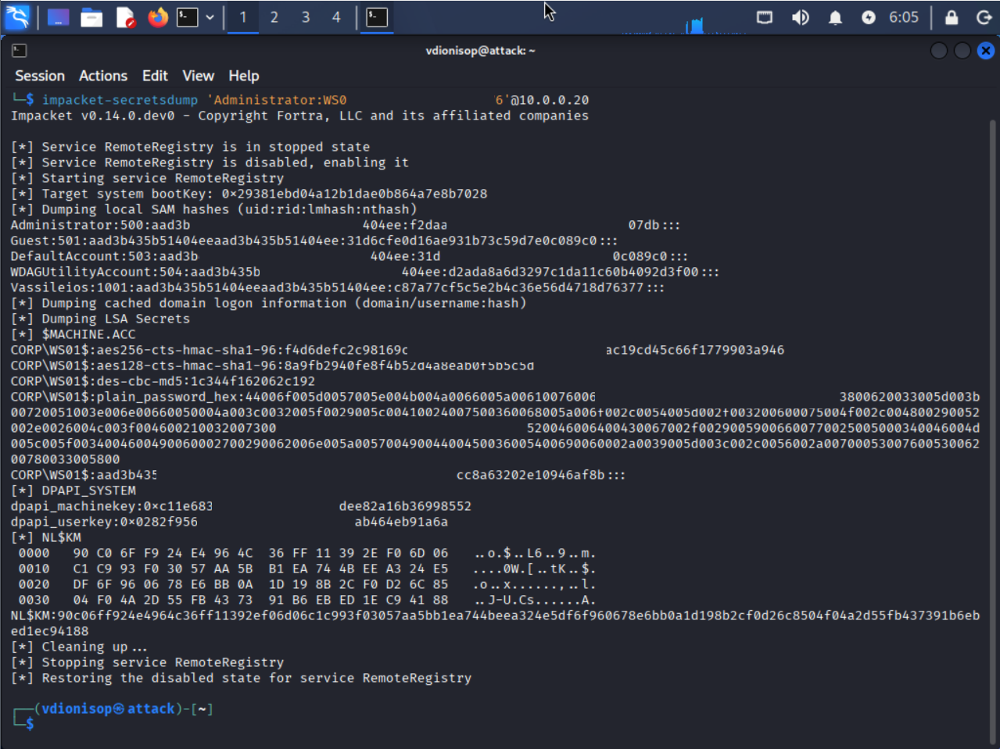
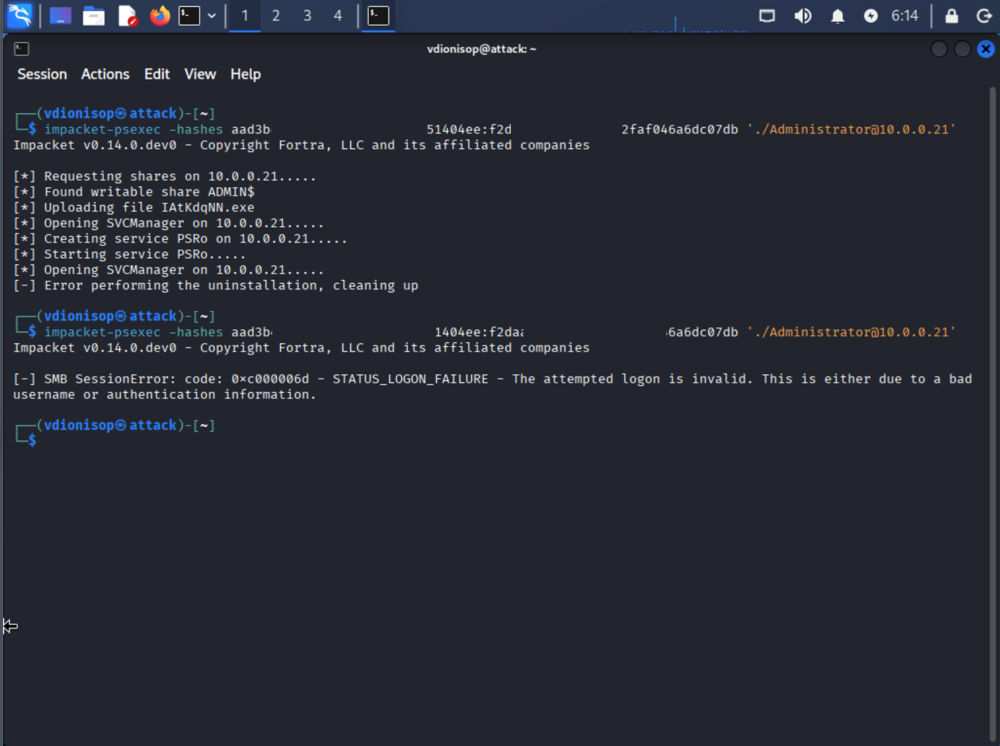
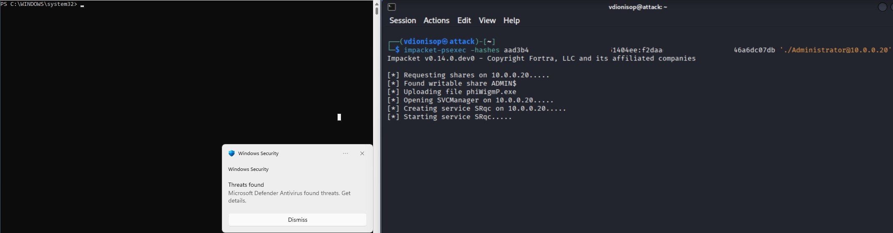

# Demo 1 — Pass-the-Hash defeated by LAPS

**Maps to:** [Level 2.1 — Windows LAPS](../../../docs/02-quick-wins/README.md#21-windows-laps)

This demo proves, hands-on, the single most important lesson of Level 2.1: **a shared local Administrator password lets an attacker move laterally across machines using a stolen hash — and unique per-machine passwords (what LAPS provides) stop it cold.**

The proof is a before/after: the *same* attack command, run twice against the *same* target, succeeds when the password is shared and fails when it's unique. Nothing changes except the password.

---

## The attack in one picture





---

## Lab state

| Machine | Role | IP |
|---------|------|-----|
| DC01 | Domain Controller (`corp.lab`) | 10.0.0.10 |
| WS01 | Domain-joined workstation (first victim) | 10.0.0.20 |
| WS02 | Domain-joined workstation (lateral-movement target) | 10.0.0.21 |
| ATTACK | Kali Linux (attacker) | 10.0.0.50 |

**The deliberate vulnerability:** WS01 and WS02 start with the *same* local Administrator password — the exact misconfiguration LAPS exists to eliminate.

> Two prerequisites make the demo reproducible on modern Windows 11:
> - **Firewall:** SMB (445) allowed inbound on the workstations (Win11 blocks it by default).
> - **`LocalAccountTokenFilterPolicy = 1`:** without it, Windows filters the remote local-admin token (UAC remote restriction) and pass-the-hash fails at logon. Setting it reflects the many real environments where management tooling has already enabled it.

---

## Part 1 — The attack (shared password)

### Step 1: Extract the hash from WS01

From Kali, dump WS01's local SAM using the (assumed-compromised) local admin credential:

```bash
impacket-secretsdump 'Administrator:Lab-Shared-P@ss123'@10.0.0.20
```

The key line in the output is the local Administrator entry (RID **500**, the built-in local admin), whose final field is the **NTLM hash**:



That single value is all the attacker needs. The dump also yields the machine account hash, DPAPI keys, and cached secrets — one local-admin compromise exposes the machine's entire credential store.

### Step 2: Pass-the-hash to WS02

Replay the WS01 hash against WS02 — **without knowing the password** (the `./` prefix marks the account as local, required by recent impacket):

```bash
impacket-psexec -hashes aad3b435b51404eeaad3b435b51404ee:<NTHASH> './Administrator@10.0.0.21'
```

The attacker authenticates to a *different* machine and creates a service — `Found writable share ADMIN$`, `Creating service`, `Starting service`. **Lateral movement achieved:** the hash from WS01 unlocked WS02 because both shared one password.

*(See the top half of the before/after screenshot below.)*

---

## Part 2 — The defense (LAPS gives unique passwords)

LAPS assigns every machine a **different, random, rotated** local admin password. To demonstrate the effect without deploying the full LAPS infrastructure, give WS02 a unique password — exactly what LAPS would do:

On **WS02** (elevated):

```powershell
$pw = ConvertTo-SecureString "WS02-Unique-R@nd0m-9876" -AsPlainText -Force
Set-LocalUser -Name Administrator -Password $pw
```

### Re-run the identical attack

From Kali, the **same command as Step 2**, unchanged. The before/after is captured in a single screenshot: the first run (shared password) creates the service and succeeds; the second run (after WS02 gets a unique password) returns `STATUS_LOGON_FAILURE`:



**The attack fails.** WS02's password — and therefore its hash — no longer matches WS01's. The stolen hash is now worthless against it. This is precisely the containment LAPS provides across an entire fleet: a hash dumped from one machine unlocks nothing else.

---

## Defense in depth observed

During testing, two additional Windows protections fired without any configuration — a reminder that real environments layer defenses:



- **Microsoft Defender** flagged and quarantined the default impacket service binary (a known signature), breaking the payload's cleanup even when authentication succeeded. In production this is an additional layer catching the tooling, independent of the password issue.
- **Tamper Protection** prevented disabling Defender via `Set-MpPreference` from an elevated prompt — the standard "just turn off AV" step silently failed.

The lesson: LAPS closes the *authentication* path (the subject of Level 2.1), while AV and tamper protection independently contest the *payload* path. Defense in depth means an attacker must defeat all of them, not one.

---

## What this proves for the roadmap

The same command, same hash, same target: **success with a shared password, failure with a unique one.** That single-variable difference is the entire argument for LAPS (Level 2.1), demonstrated rather than asserted.
